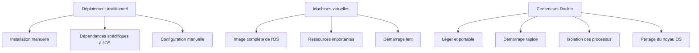

# Guide détaillé pour tester l'application

## Test local de l'application

Une fois que vous avez lancé l'application avec Docker Compose (`docker-compose up -d`), vous pouvez effectuer les tests suivants pour vérifier que toutes les fonctionnalités fonctionnent correctement :

### Créer un compte

1. Remplissez le formulaire "Créer un compte" avec :
   - Numéro de compte : "ACC001"
   - Nom du titulaire : "Jean Dupont"
   - Solde initial : 1000
2. Cliquez sur "Créer".
3. Vérifiez que le compte apparaît dans la liste des comptes.

### Consulter un compte

1. Dans le formulaire "Opérations sur un compte", entrez :
   - Numéro de compte : "ACC001"
2. Cliquez sur "Consulter".
3. Vérifiez que les détails du compte s'affichent dans la section "Résultat".

### Déposer de l'argent

1. Dans le formulaire "Opérations sur un compte", entrez :
   - Numéro de compte : "ACC001"
   - Montant : 500
2. Cliquez sur "Déposer".
3. Vérifiez que le solde est maintenant de 1500 €.

### Retirer de l'argent

1. Dans le formulaire "Opérations sur un compte", entrez :
   - Numéro de compte : "ACC001"
   - Montant : 200
2. Cliquez sur "Retirer".
3. Vérifiez que le solde est maintenant de 1300 €.

### Tester les validations

1. Essayez de retirer plus d'argent que le solde disponible.
2. Essayez de créer un compte avec un numéro qui existe déjà.
3. Vérifiez que les messages d'erreur appropriés s'affichent.

### Supprimer un compte

1. Dans le formulaire "Opérations sur un compte", entrez :
   - Numéro de compte : "ACC001"
2. Cliquez sur "Supprimer".
3. Vérifiez que le compte a été supprimé de la liste.

### Vérification des logs Docker

Pour vérifier que tout fonctionne correctement au niveau des conteneurs :

```shell
# Vérifier les logs de l'application
docker logs app-bancaire

# Vérifier les logs de MongoDB
docker logs mongo

# Vérifier que les conteneurs sont en cours d'exécution
docker ps
```

## Instructions détaillées pour Docker Hub

### Préparation de l'image pour Docker Hub

Avant de pousser l'image vers Docker Hub, assurez-vous qu'elle est optimisée :

```shell
# Construire l'image avec un tag spécifique
docker build -t application-bancaire:v1.0 .

# Vérifier la taille de l'image
docker images | grep application-bancaire
```

### Processus complet pour Docker Hub

1. **Créer un repository sur Docker Hub** :
   - Connectez-vous à [Docker Hub](https://hub.docker.com/).
   - Cliquez sur "Create Repository".
   - Nommez-le "application-bancaire".
   - Choisissez "Public" ou "Private" selon vos besoins.
   - Cliquez sur "Create".

2. **Tagger l'image avec plusieurs versions** :

```shell
# Tagger avec latest
docker tag application-bancaire:v1.0 esscraye/application-bancaire:latest

# Tagger avec un numéro de version
docker tag application-bancaire:v1.0 esscraye/application-bancaire:v1.0
```

3. **Pousser les images vers Docker Hub** :

```shell
# Pousser la version latest
docker push esscraye/application-bancaire:latest

# Pousser la version spécifique
docker push esscraye/application-bancaire:v1.0
```

4. **Vérifier sur Docker Hub** :
   - Visitez `https://hub.docker.com/r/esscraye/application-bancaire`.
   - Vérifiez que les deux tags (latest et v1.0) sont présents.

## Test sur une autre machine

Pour tester l'image sur une autre machine, suivez ces étapes détaillées :

```shell
# 1. Installer Docker si ce n'est pas déjà fait
# Pour Ubuntu :
# sudo apt update
# sudo apt install docker.io docker-compose

# 2. Créer un fichier docker-compose.yml
cat > docker-compose.yml << 'EOF'
version: '3'
services:
  app:
    image: esscraye/application-bancaire:latest
    ports:
      - "3000:3000"
    environment:
      - MONGODB_URI=mongodb://mongo:27017/banque
    depends_on:
      - mongo
    restart: always

  mongo:
    image: mongo:latest
    ports:
      - "27017:27017"
    volumes:
      - mongo-data:/data/db
    restart: always

volumes:
  mongo-data:
EOF

# 3. Lancer l'application
docker-compose up -d

# 4. Vérifier que les conteneurs sont en cours d'exécution
docker-compose ps
```

## Comparaison avec d'autres méthodes de déploiement

Pour mieux comprendre les avantages des conteneurs, voici une comparaison avec d'autres méthodes de déploiement :



## Troubleshooting

Voici quelques problèmes courants et leurs solutions :

- **Problème** : L'application ne démarre pas
  - **Solution** : Vérifiez les logs avec `docker logs app-bancaire`.
- **Problème** : Impossible de se connecter à MongoDB
  - **Solution** : Vérifiez que le conteneur MongoDB est en cours d'exécution et que l'URL de connexion est correcte.
- **Problème** : L'image est trop volumineuse
  - **Solution** : Utilisez une image de base plus légère comme `node:18-alpine` et optimisez le Dockerfile.
- **Problème** : Les modifications de code ne sont pas prises en compte
  - **Solution** : Reconstruisez l'image avec `docker-compose up -d --build`.
- **Problème** : Erreur "port already in use"
  - **Solution** : Changez le port dans `docker-compose.yml` ou arrêtez le service qui utilise ce port.

## Sécurité et bonnes pratiques

Pour une application en production, considérez ces bonnes pratiques :

### Sécurité

- Utilisez des secrets Docker pour les informations sensibles.
- Limitez les privilèges des conteneurs.
- Scannez régulièrement les images pour les vulnérabilités.

### Performance

- Utilisez des volumes pour la persistance des données.
- Configurez des limites de ressources pour les conteneurs.
- Utilisez un réseau dédié pour la communication inter-conteneurs.

### Maintenance

- Mettez en place une stratégie de sauvegarde pour MongoDB.
- Automatisez les mises à jour des images.
- Utilisez des health checks pour surveiller l'état des conteneurs.

## Conclusion

Cette application bancaire conteneurisée démontre efficacement l'utilisation de Docker pour créer, déployer et partager une application complète avec sa base de données. Les conteneurs offrent une solution élégante aux problèmes de déploiement et de gestion des dépendances, tout en facilitant la collaboration entre les équipes de développement et d'opérations.

En suivant ce guide, vous avez appris à :

- Créer une application Node.js avec MongoDB.
- Conteneuriser l'application avec Docker.
- Utiliser Docker Compose pour orchestrer plusieurs conteneurs.
- Publier et partager votre image sur Docker Hub.
- Déployer l'application sur différentes machines.

Ces compétences sont essentielles dans le développement moderne et constituent une base solide pour des déploiements plus complexes avec des outils comme Kubernetes.
